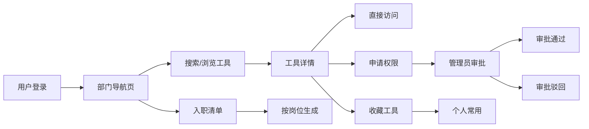

## 1. 产品概述

团队工具收藏夹是面向市场部和客服部的内部工具导航平台，旨在沉淀常用 SaaS、内部后台和资料入口，解决新人入职找不到正确链接、工具信息分散、权限申请流程不透明等问题。

- **目标用户**：市场部、客服部全体成员及管理员
- **核心价值**：统一工具入口、降低新人上手成本、提升团队协作效率
- **产品定位**：企业内部工具导航与管理平台

## 2. 核心功能

### 2.1 用户角色

| 角色 | 描述 | 核心权限 |
|------|------|----------|
| 普通成员 | 市场部/客服部员工 | 浏览工具、搜索、收藏、申请权限、查看说明、提交反馈、推荐工具、订阅通知、生成入职清单、查看排行、工具对比 |
| 管理员 | 部门负责人/运维人员 | 全部成员权限 + 工具增删改、权限审批、变更记录管理、反馈处理 |

### 2.2 功能模块

1. **部门导航页**：按部门分类展示工具入口、快速搜索、个人常用工具
2. **工具目录**：完整工具列表、分类筛选、标签筛选、岗位匹配
3. **权限申请页**：申请列表、申请表单、审批状态追踪
4. **使用说明页**：操作指南、常见问题、视频教程
5. **变更记录页**：版本更新日志、工具变更通知
6. **个人中心**：我的收藏、我的申请、订阅设置、入职清单
7. **管理后台**：工具管理、权限管理、反馈管理、数据统计

### 2.3 页面详情

| 页面名称 | 模块名称 | 功能描述 |
|----------|----------|----------|
| 部门导航页 | 顶部导航 | Logo、搜索框、用户菜单、通知中心 |
| 部门导航页 | 部门切换 | 市场部/客服部切换标签 |
| 部门导航页 | 快捷入口 | 常用工具卡片网格展示，支持拖拽排序 |
| 部门导航页 | 分类浏览 | 按工具分类展示入口列表 |
| 部门导航页 | 热门排行 | 访问量 Top10 工具展示 |
| 工具目录页 | 筛选侧边栏 | 分类、标签、岗位、状态筛选 |
| 工具目录页 | 工具卡片 | 工具图标、名称、描述、负责人、收藏按钮、访问按钮 |
| 工具目录页 | 工具详情 | 入口地址、适用岗位、注意事项、操作指南、相关工具 |
| 工具目录页 | 工具对比 | 同类工具并排对比功能 |
| 权限申请页 | 申请列表 | 我的申请记录、状态、审批进度 |
| 权限申请页 | 申请表单 | 选择工具、填写申请理由、紧急程度 |
| 权限申请页 | 审批管理 | 管理员审批、驳回、备注（管理员） |
| 使用说明页 | 分类导航 | 按工具分类的使用说明 |
| 使用说明页 | 指南内容 | 图文教程、步骤说明、常见问题 |
| 使用说明页 | 视频教程 | 操作演示视频嵌入 |
| 变更记录页 | 时间线 | 工具变更历史时间轴展示 |
| 变更记录页 | 订阅设置 | 变更通知订阅、通知方式选择 |
| 个人中心 | 我的收藏 | 收藏的工具列表、管理收藏 |
| 个人中心 | 入职清单 | 按岗位生成的工具学习清单、完成进度 |
| 个人中心 | 我的反馈 | 失效链接反馈、工具推荐记录 |
| 管理后台 | 工具管理 | 工具增删改、批量导入、分类管理 |
| 管理后台 | 反馈处理 | 失效链接处理、新工具推荐审核 |
| 管理后台 | 数据统计 | 访问量统计、热门工具、使用分析 |

## 3. 核心流程

### 3.1 新员工入职流程
新员工登录 → 选择岗位 → 生成入职工具清单 → 按清单学习工具使用 → 逐步申请权限 → 收藏常用工具

### 3.2 工具查找流程
用户进入导航页 → 搜索/浏览分类 → 查看工具详情 → 点击访问 / 申请权限 / 收藏

### 3.3 权限申请流程
选择工具 → 填写申请理由 → 提交申请 → 管理员审批 → 获得权限 / 被驳回

### 3.4 工具管理流程（管理员）
管理员登录 → 进入管理后台 → 添加/编辑工具信息 → 保存发布 → 生成变更记录

## 4. 用户界面设计

### 4.1 设计风格

- **整体风格**：现代简约企业风，清爽专业，信息层级清晰
- **主色调**：深海蓝 (#1e3a5f) - 体现专业与可信赖感
- **辅助色**：活力橙 (#ff6b35) - 用于强调和操作按钮
- **中性色**：灰白渐变背景，深灰文字，保持专业感
- **字体**：
  - 标题：Noto Sans SC，粗体，简洁有力
  - 正文：Noto Sans SC，常规，清晰易读
- **布局风格**：顶部导航 + 左侧筛选 + 主内容区的经典企业布局
- **卡片设计**：圆角卡片、轻柔阴影、悬停微浮起效果
- **图标风格**：线性图标，统一 2px 描边，简洁现代

### 4.2 页面设计概览

| 页面名称 | 模块名称 | UI 元素 |
|----------|----------|---------|
| 部门导航页 | Hero 区域 | 大标题、搜索框、部门切换标签 |
| 部门导航页 | 常用工具 | 卡片网格布局、图标+名称、收藏标记 |
| 部门导航页 | 分类入口 | 图标+文字、横向滚动、渐变色块 |
| 部门导航页 | 热门排行 | 序号徽章、工具名称、访问量数字 |
| 工具目录页 | 筛选侧边栏 | 折叠分类、多选标签、滑动条 |
| 工具目录页 | 工具列表 | 卡片列表、排序切换、分页 |
| 工具目录页 | 对比面板 | 并排卡片、差异高亮、推荐标记 |
| 权限申请页 | 申请列表 | 状态标签、时间线进度、操作按钮 |
| 使用说明页 | 目录导航 | 锚点导航、折叠面板、进度指示 |
| 变更记录页 | 时间线 | 竖线时间轴、版本标签、变更类型图标 |

### 4.3 响应式

- 采用桌面端优先设计，适配 1440px、1920px 等常见分辨率
- 平板端：侧边栏可折叠，卡片布局自适应
- 移动端：顶部导航折叠为汉堡菜单，单列布局，简化交互
- 触摸优化：按钮最小高度 44px，手势滑动支持

### 4.4 动效设计

- 页面加载：元素渐入 + 轻微上移动画
- 卡片悬停：上移 2px + 阴影加深 + 边框高亮
- 搜索联想：下拉列表平滑展开
- 模态框：缩放 + 淡入效果
- 收藏按钮：心形图标弹跳动画
- 侧边栏：平滑滑入滑出
