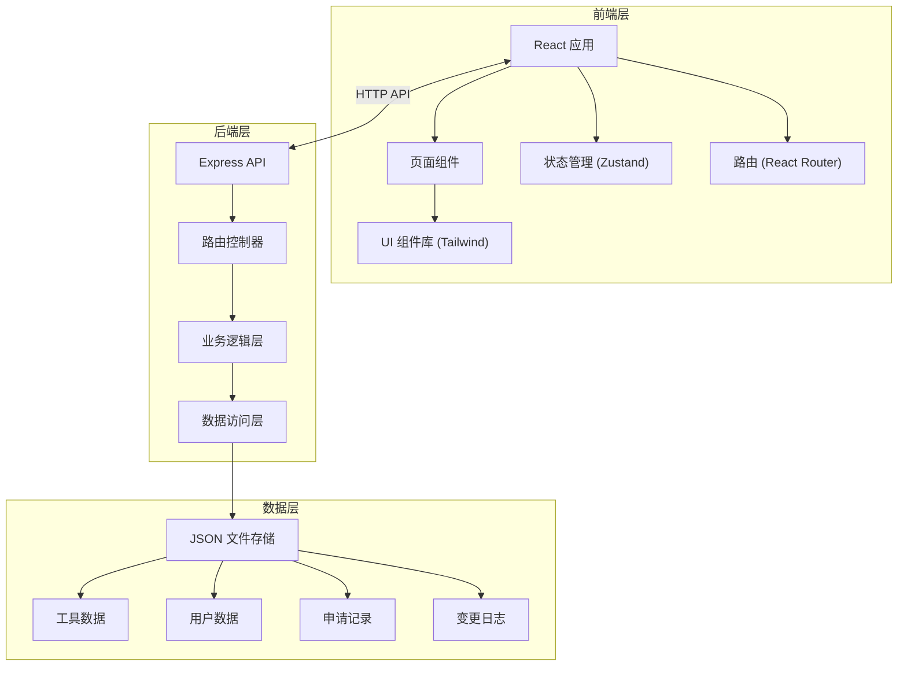
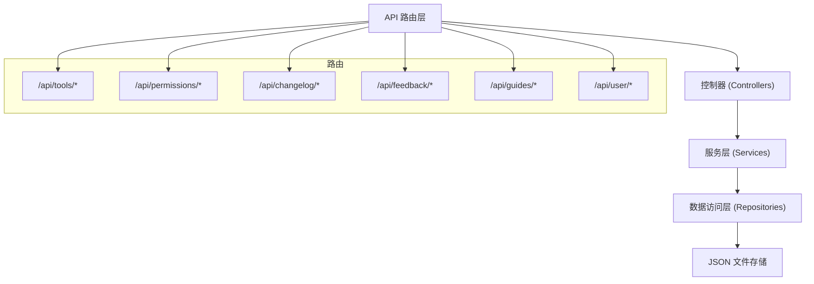
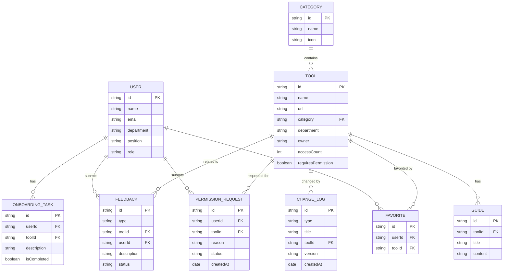

## 1. 架构设计



## 2. 技术描述

- **前端框架**：React@18 + TypeScript
- **构建工具**：Vite
- **样式方案**：Tailwind CSS@3
- **状态管理**：Zustand
- **路由管理**：React Router DOM@6
- **图标库**：Lucide React
- **后端框架**：Express@4
- **数据存储**：本地 JSON 文件（模拟数据库，便于演示）
- **初始化工具**：vite-init (react-express-ts 模板)

## 3. 路由定义

| 路由路径 | 页面名称 | 说明 |
|----------|----------|------|
| / | 部门导航页 | 首页，展示快捷入口和热门工具 |
| /tools | 工具目录 | 完整工具列表和筛选 |
| /tools/:id | 工具详情 | 单个工具的详细信息 |
| /tools/compare | 工具对比 | 同类工具对比页面 |
| /permission | 权限申请 | 权限申请列表和表单 |
| /guides | 使用说明 | 工具使用指南和教程 |
| /changelog | 变更记录 | 工具变更历史和通知 |
| /profile | 个人中心 | 我的收藏、入职清单、订阅设置 |
| /profile/favorites | 我的收藏 | 收藏的工具列表 |
| /profile/onboarding | 入职清单 | 按岗位生成的学习清单 |
| /admin | 管理后台 | 工具管理、反馈处理（管理员） |
| /admin/tools | 工具管理 | 增删改工具信息 |
| /admin/feedback | 反馈管理 | 处理失效链接和推荐 |

## 4. API 定义

### 4.1 工具相关接口

| 方法 | 路径 | 说明 |
|------|------|------|
| GET | /api/tools | 获取工具列表，支持筛选、分页、搜索 |
| GET | /api/tools/:id | 获取单个工具详情 |
| POST | /api/tools | 新增工具（管理员） |
| PUT | /api/tools/:id | 更新工具信息（管理员） |
| DELETE | /api/tools/:id | 删除工具（管理员） |
| GET | /api/tools/categories | 获取工具分类列表 |
| GET | /api/tools/popular | 获取热门工具排行 |
| POST | /api/tools/:id/toggle-favorite | 收藏/取消收藏工具 |
| GET | /api/tools/favorites | 获取我的收藏列表 |

### 4.2 权限申请接口

| 方法 | 路径 | 说明 |
|------|------|------|
| GET | /api/permissions | 获取我的申请列表 |
| POST | /api/permissions | 提交权限申请 |
| GET | /api/permissions/:id | 获取申请详情 |
| PUT | /api/permissions/:id/approve | 审批通过（管理员） |
| PUT | /api/permissions/:id/reject | 审批驳回（管理员） |

### 4.3 变更记录接口

| 方法 | 路径 | 说明 |
|------|------|------|
| GET | /api/changelog | 获取变更记录列表 |
| POST | /api/changelog | 新增变更记录（管理员） |

### 4.4 反馈接口

| 方法 | 路径 | 说明 |
|------|------|------|
| GET | /api/feedback | 获取反馈列表（管理员） |
| POST | /api/feedback | 提交反馈/推荐 |
| PUT | /api/feedback/:id | 处理反馈（管理员） |

### 4.5 使用指南接口

| 方法 | 路径 | 说明 |
|------|------|------|
| GET | /api/guides | 获取指南列表 |
| GET | /api/guides/:id | 获取指南详情 |

### 4.6 用户相关接口

| 方法 | 路径 | 说明 |
|------|------|------|
| GET | /api/user/profile | 获取用户信息 |
| PUT | /api/user/profile | 更新用户信息 |
| GET | /api/user/onboarding | 获取入职清单 |
| POST | /api/user/onboarding/:taskId/complete | 标记入职任务完成 |
| GET | /api/user/subscriptions | 获取订阅设置 |
| PUT | /api/user/subscriptions | 更新订阅设置 |

### 4.7 TypeScript 类型定义

```typescript
// 工具类型
interface Tool {
  id: string;
  name: string;
  description: string;
  url: string;
  icon: string;
  category: string;
  department: 'marketing' | 'customer-service' | 'all';
  positions: string[];
  owner: string;
  ownerEmail: string;
  notes: string;
  accessCount: number;
  isFavorite: boolean;
  requiresPermission: boolean;
  hasPermission: boolean;
  createdAt: string;
  updatedAt: string;
  tags: string[];
}

// 工具分类
interface Category {
  id: string;
  name: string;
  icon: string;
  count: number;
}

// 权限申请
interface PermissionRequest {
  id: string;
  toolId: string;
  toolName: string;
  reason: string;
  urgency: 'low' | 'medium' | 'high';
  status: 'pending' | 'approved' | 'rejected';
  applicant: string;
  approver?: string;
  approveNote?: string;
  createdAt: string;
  updatedAt: string;
}

// 变更记录
interface ChangeLog {
  id: string;
  type: 'add' | 'update' | 'delete' | 'fix';
  title: string;
  description: string;
  toolId?: string;
  toolName?: string;
  version: string;
  createdAt: string;
}

// 使用指南
interface Guide {
  id: string;
  toolId: string;
  toolName: string;
  title: string;
  content: string;
  category: string;
  order: number;
}

// 反馈
interface Feedback {
  id: string;
  type: 'broken-link' | 'recommend' | 'other';
  toolId?: string;
  toolName?: string;
  title: string;
  description: string;
  submitter: string;
  status: 'pending' | 'processing' | 'resolved';
  createdAt: string;
}

// 用户
interface User {
  id: string;
  name: string;
  email: string;
  avatar: string;
  department: 'marketing' | 'customer-service';
  position: string;
  role: 'member' | 'admin';
  subscriptions: {
    changelog: boolean;
    toolUpdates: boolean;
    permissionStatus: boolean;
  };
}

// 入职清单任务
interface OnboardingTask {
  id: string;
  toolId: string;
  toolName: string;
  description: string;
  category: string;
  isCompleted: boolean;
  completedAt?: string;
}
```

## 5. 服务端架构图



## 6. 数据模型

### 6.1 数据模型 ER 图



### 6.2 初始数据

包含以下初始 Mock 数据：

- **工具数据**：20+ 个常用工具，覆盖市场部和客服部
  - SaaS 工具：飞书、钉钉、企业微信、石墨文档、腾讯文档
  - 数据分析：GrowingIO、神策数据、百度统计
  - 营销工具：公众号后台、视频号助手、巨量引擎、小红书专业号
  - 客服工具：智齿客服、网易七鱼、美洽
  - 内部系统：OA 系统、CRM 系统、知识库、HR 系统
- **分类数据**：10+ 个工具分类
- **用户数据**：3 个示例用户（2 普通成员 + 1 管理员）
- **变更记录**：10 条历史变更
- **使用指南**：5 篇入门教程
- **入职清单**：按岗位预设任务
